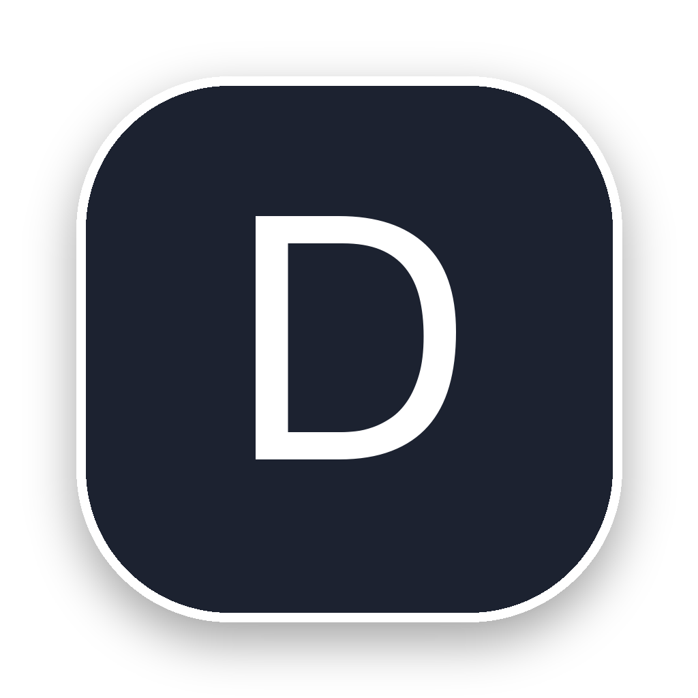

<div align="center">

<br/>



<br/>
<br/>

# DroidScreen

### Turn your Android tablet into a real second screen — low latency, native touch, built-in Stream Deck.

<br/>

[](https://github.com/DanielD2G/DroidScreen)
[](LICENSE)
[](https://github.com/DanielD2G/DroidScreen)
[](https://github.com/DanielD2G/DroidScreen)

<br/>

*Open source · USB-first · Hardware-accelerated · No subscriptions*

<br/>

</div>

---

## Why DroidScreen?

Most people have an Android tablet sitting unused in a drawer. Meanwhile, a decent second monitor costs hundreds of dollars, a Stream Deck is yet another device on the desk, and existing software solutions are a constant compromise.

**The problem isn't that the technology doesn't exist — it's that nobody had put it together properly.**

DroidScreen was born out of a specific frustration: wanting to use a tablet as a real work second screen, with no perceptible latency, native touch input, and a Stream Deck-style shortcut panel. That tool didn't exist. Especially not in open source.

Existing apps work mainly over Wi-Fi — which means variable latency, compression artifacts, and unnecessarily high CPU usage. They are closed, subscription-based solutions that treat the tablet as a passive display.

DroidScreen does things differently:

- **USB-first** — ADB reverse tunneling for predictable, stable latency
- **Real touch** — not mouse emulation, but native touch events with pressure and multitouch
- **First-class stylus** — pressure, tilt, rotation, hover distance
- **Built-in Deck** — action panel, media and volume controls, no extra hardware needed
- **Hardware encode** — VideoToolbox on Mac, FFmpeg with NVENC/QSV/AMF on Windows
- **No intermediate server** — the desktop app talks directly to the Android app

---

## Features

<table>
<tr>
<td width="50%" valign="top">

### Video
- Up to **120 FPS** with hardware encoding
- **H.264 / HEVC** depending on encoder availability
- Adaptive bitrate based on USB cable conditions
- Real-time stats overlay: bitrate, FPS, jitter, frame stability
- 16 MB ring buffer to absorb USB jitter without dropping frames

</td>
<td width="50%" valign="top">

### Input
- **Native multi-touch** — no emulation
- **Full stylus support** — pressure, X/Y tilt, rotation, hover, buttons
- **Mouse** — absolute position, configurable buttons
- Per-pointer-type modes: native / cursor / ignore
- Settings persist across sessions

</td>
</tr>
<tr>
<td width="50%" valign="top">

### Deck Panel
- Configurable tile grid on the tablet
- **App launcher tiles** — custom icon and label
- **Media tile** — cover art, title and artist; tap to control playback
- **Volume tile** — slider + mute, synced with desktop audio
- Auto-hide (6s timeout) or permanently pinned

</td>
<td width="50%" valign="top">

### System Integration
- **macOS**: Menu bar app, ScreenCaptureKit, MediaRemote
- **Windows**: System tray app, WGC, automatic GPU detection
- Automatic ADB device detection
- Reconnect without restarting the app

</td>
</tr>
</table>

---

## How It Works

DroidScreen runs a 3-stage pipeline on the desktop and a receiver on Android, connected by a lightweight binary protocol tunneled through ADB over USB.

```
┌────────────────────────────── Desktop ────────────────────────────────┐
│                                                                        │
│   ┌──────────────────┐   ┌──────────────────────┐   ┌─────────────┐  │
│   │     Capture      │──▶│        Encode         │──▶│    Send     │  │
│   │  SCKit / WGC     │   │ VideoToolbox / FFmpeg │   │  TCP / ADB  │  │
│   └──────────────────┘   └──────────────────────┘   └──────┬──────┘  │
│    Always the latest          HW-first, SW fallback         │         │
│    frame available                                          │ USB     │
│   ◀─────────────── Touch · Stylus · Mouse · Deck ──────────┘         │
└───────────────────────────────────────────────────────────────────────┘
                                    │
                              adb reverse
                             (USB tunnel)
                                    │
┌────────────────────────────── Android ────────────────────────────────┐
│                                                                        │
│   ┌───────────┐     ┌────────────────┐     ┌────────────────────────┐ │
│   │ TCP Server│────▶│  MediaCodec HW │────▶│ SurfaceView + Deck UI  │ │
│   └───────────┘     └────────────────┘     └────────────────────────┘ │
│                                                                        │
│   Input captured on tablet ───────────────────────────────▶ Desktop   │
└───────────────────────────────────────────────────────────────────────┘
```

Each stage runs in its own thread with frame queues that drop stale frames — the pipeline always processes the most recent frame, never the oldest.

---

## Protocol

DroidScreen uses a custom binary protocol optimized for real-time streaming over USB:

| Message | ID | Description |
|---|:---:|---|
| Handshake | `0x01` / `0x02` | Negotiate resolution, FPS, codec, bitrate |
| Video Frame | `0x10` | H.264 / HEVC NAL units |
| Touch | `0x20` | Fractional coordinates (0–65535), pressure, pointer type |
| Pen | `0x21` | Pressure, hover distance, X/Y tilt, rotation, buttons |
| Mouse | `0x22` | Absolute position, button state |
| Control | `0x30` | Resolution change, bitrate update, keyframe request |
| Deck | `0x40–0x44` | Panel config, media state, volume, actions |
| Ping / Pong | `0xF0` / `0xF1` | Real-time RTT measurement |

**Framing**: 6-byte headers `[type:u8][flags:u8][length:u32LE]` — zero serialization overhead.

---

## Comparison

| | DroidScreen | Typical paid app | Typical free app |
|---|:---:|:---:|:---:|
| Open source | ✅ | ❌ | ❌ |
| USB connection | ✅ | Partial | ❌ |
| Native touch | ✅ | Partial | ❌ |
| Stylus with pressure | ✅ | ❌ | ❌ |
| Built-in Stream Deck | ✅ | ❌ | ❌ |
| Hardware encoding | ✅ | ❌ | ❌ |
| No subscription | ✅ | ❌ | ✅ |
| macOS + Windows | ✅ | Varies | Varies |

---

## Platform Support

| Platform | Requirements | Encoder |
|---|---|---|
| **macOS 13+** | Apple Silicon or Intel, Screen Recording permission | VideoToolbox (HEVC / H.264) |
| **Windows 10+** | GPU with updated drivers | NVENC · QSV · AMF · libx264 (fallback) |
| **Android 8.0+** (API 26) | USB debugging enabled | MediaCodec (HW decode) |

---

## Quick Start

**Prerequisites:** ADB installed, USB debugging enabled on the tablet, USB cable.

```bash
# Clone the repo
git clone https://github.com/DanielD2G/DroidScreen.git
cd DroidScreen
```

<details>
<summary><strong>macOS</strong></summary>

```bash
./scripts/build_macos.sh
```

On first launch: **System Settings → Privacy & Security → Screen Recording → enable DroidScreen**.

Requires: Xcode Command Line Tools, CMake 3.20+

</details>

<details>
<summary><strong>Windows</strong></summary>

```bat
scripts\build_windows.bat
```

Requires: Visual Studio 2022, CMake 3.20+, FFmpeg 7.1

</details>

<details>
<summary><strong>Android</strong></summary>

```bash
export JAVA_HOME="/opt/homebrew/opt/openjdk@17"
export ANDROID_HOME="$HOME/Library/Android/sdk"
cd android && ./gradlew assembleDebug
# APK: android/app/build/outputs/apk/debug/app-debug.apk
```

Requires: JDK 17, Android SDK 34, NDK 26.x

</details>

```bash
# Connect the tablet and set up the USB tunnel
./scripts/adb_setup.sh

# Build everything and run
./scripts/run.sh
```

For detailed build instructions and prerequisites, check the build scripts inside `scripts/`.

---

## Project Status

> ⚠️ **DroidScreen is in active beta.**
>
> The core works well for daily use, but expect rough edges, protocol changes between versions, and unfinished features. Bug reports and contributions are very welcome.

| Component | Current version |
|---|:---:|
| macOS desktop | `0.0.6` |
| Windows desktop | `0.0.6` |
| Android app | `0.0.6` |

---

## Roadmap

- [ ] Audio streaming (desktop → tablet)
- [ ] Camera Support 
- [ ] Visual Deck editor (drag-and-drop tile configuration from desktop)
- [ ] Linux desktop support
- [ ] Haptic feedback passthrough on Windows

---

## Key Technologies

| Stack | Role |
|---|---|
| **C++17 / C11** | Desktop pipeline, shared protocol library |
| **Objective-C++** | Native macOS integration (SCKit, VideoToolbox, MediaRemote) |
| **Kotlin + JNI** | Android app with native C++ bridge |
| **ScreenCaptureKit** | Screen capture on macOS 13+ |
| **VideoToolbox** | HEVC/H.264 hardware encode on Apple Silicon and Intel |
| **Windows.Graphics.Capture** | Efficient screen capture on Windows |
| **FFmpeg** | H.264 encode on Windows with automatic GPU detection |
| **Android MediaCodec** | Hardware decode on the tablet |
| **CMake 3.20+ / Gradle** | Cross-platform build system |

---

## AI-Assisted Development

DroidScreen is developed with the assistance of **[Claude](https://anthropic.com)** (Anthropic) and **[Codex](https://openai.com)** (OpenAI). Some parts of the codebase are AI-generated; others are written entirely by hand. We use each where it makes sense.

We think being transparent about this is the right call.

---

## Acknowledgements

DroidScreen wouldn't exist without the work of these projects:

**[FFmpeg](https://ffmpeg.org/)** — The gold standard in multimedia. Used on Windows for hardware H.264 encoding with automatic GPU detection (NVENC, QSV, AMF) and a clean libx264 fallback. Essential.

**[Sunshine](https://github.com/LizardByte/Sunshine)** — The open-source game streaming server that proved low-latency, hardware-accelerated desktop streaming is fully achievable without magic. A reference architecture and the mental starting point for DroidScreen's pipeline.

**[scrcpy](https://github.com/Genymobile/scrcpy)** — The OG Android mirroring tool. DroidScreen reverses the direction (desktop → tablet instead of tablet → desktop), but scrcpy is a masterclass in keeping things simple, efficient, and direct.

**[Parsec VDD](https://github.com/nomi-san/parsec-vdd)** — Virtual display driver for Windows. Inspiration for the virtual display implementation that lets the Deck work without a physical monitor.

And to the developer community that documents the dark corners of ScreenCaptureKit, WGC, VideoToolbox, and MediaCodec — without that collective knowledge this would have taken twice as long.

---

## Contributing

1. Open an issue describing the bug or proposal
2. For bugs, include logcat output and platform details in the issue
3. Fork → branch → PR — no CLA, just clean code

---

## License

[MIT](LICENSE) — Daniel González, 2025

---

<div align="center">

<br/>

*Built out of genuine frustration with a tablet collecting dust.*

<br/>

**If DroidScreen is useful to you, drop a ⭐ — it helps more than you'd think.**

<br/>

</div>
